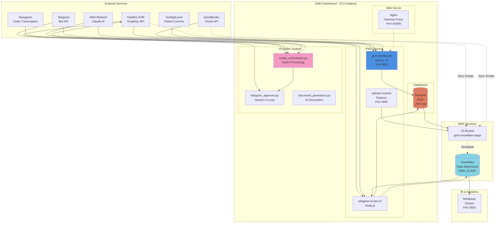
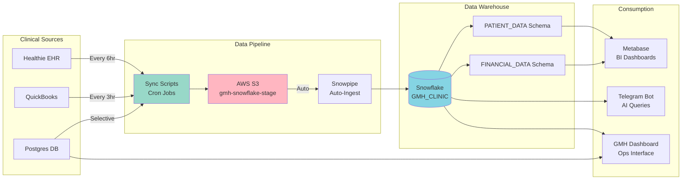
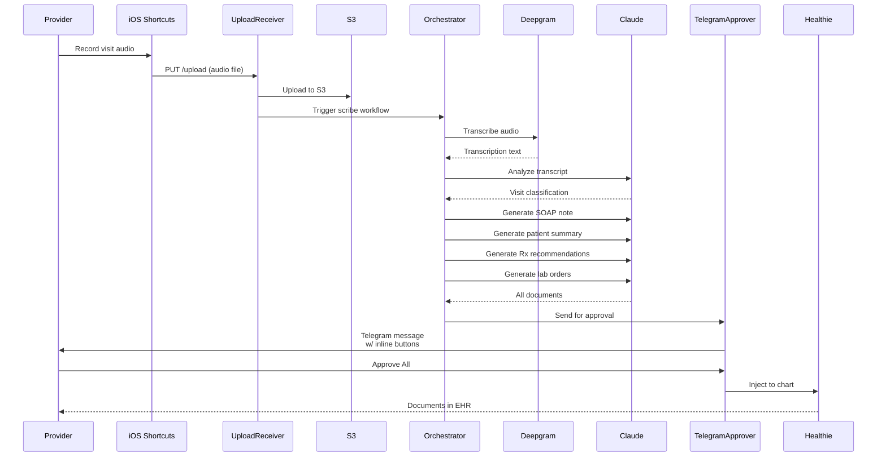
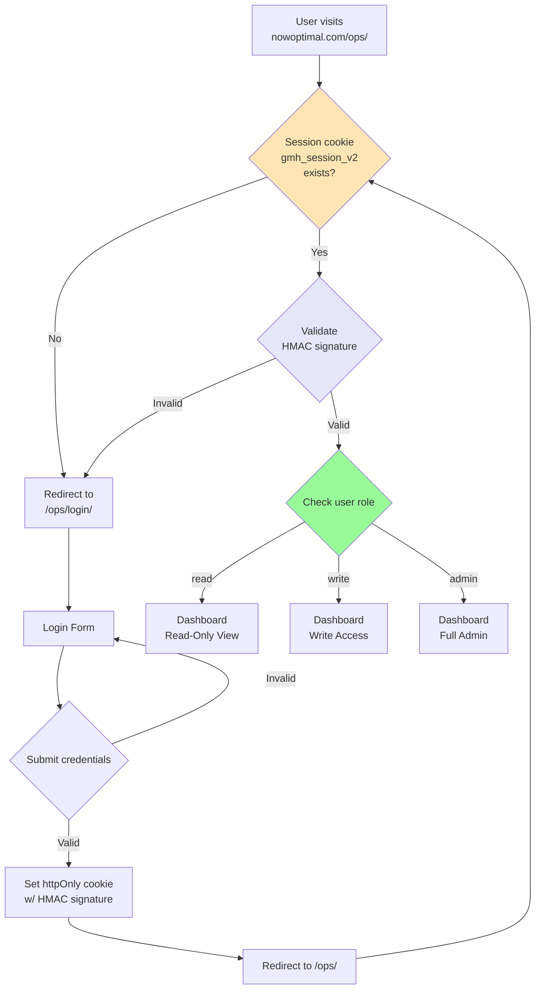
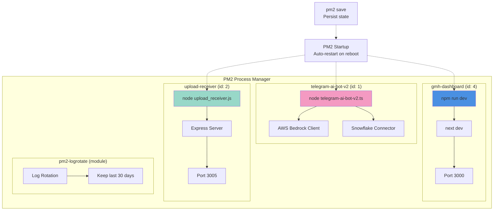
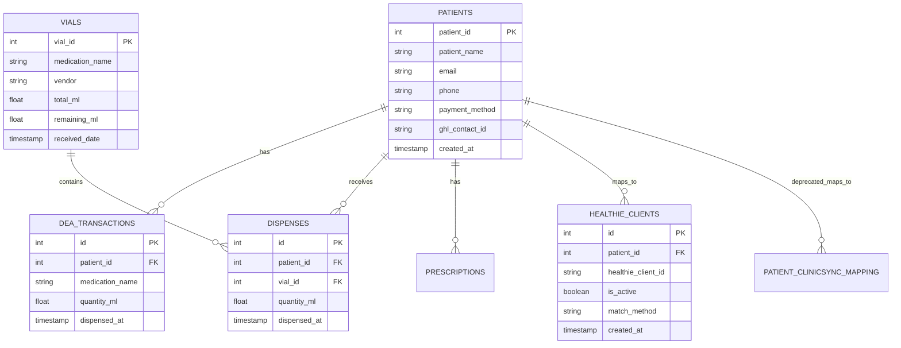

# GMH Dashboard - System Architecture Diagrams

**Last Updated**: December 28, 2025  
**Purpose**: Visual documentation of system architecture, data flows, and integrations

---

## 🏗️ High-Level System Architecture



---

## 📊 Data Flow Architecture



---

## 🤖 AI Scribe Workflow



---

## 🔐 Authentication & Authorization Flow



---

## 🔄 Request Flow (Nginx → Next.js)

```mermaid
sequenceDiagram
    participant Client
    participant Nginx
    participant NextJS
    participant API
    participant DB

    Client->>Nginx: HTTPS Request<br/>nowoptimal.com/ops/patients
    
    Note over Nginx: Check SSL certificate
    Note over Nginx: Apply security headers
    
    Nginx->>NextJS: Proxy to localhost:3000<br/>Include /ops prefix
    
    Note over NextJS: trailingSlash: true<br/>basePath: /ops
    
    NextJS->>NextJS: Check session cookie<br/>(gmh_session_v2)
    
    alt Not authenticated
        NextJS-->>Client: 307 Redirect to /ops/login/
    else Authenticated
        NextJS->>API: Call internal API<br/>withBasePath('/api/patients')
        API->>DB: Query Postgres
        DB-->>API: Patient data
        API-->>NextJS: JSON response
        NextJS-->>Client: Rendered HTML
    end

    style NextJS fill:#4A90E2
    style DB fill:#E27D60
```

---

## 📦 PM2 Process Architecture



---

## 🗄️ Database Schema (Simplified)



---

## 🔄 Cron Job Schedule

```mermaid
gantt
    title GMH Dashboard Cron Jobs
    dateFormat HH:mm
    axisFormat %H:%M
    
   section Cleanup
    Backup cleanup (2 AM)           :02:00, 1m
    
    section QuickBooks
    QB Sync (every 3hr)             :00:00, 1m
    QB Sync                         :03:00, 1m
    QB Sync                         :06:00, 1m
    QB Sync                         :09:00, 1m
    QB Sync                         :12:00, 1m
    QB Sync                         :15:00, 1m
    QB Sync                         :18:00, 1m
    QB Sync                         :21:00, 1m
    
    section Healthie
    Healthie→Snowflake (every 6hr)  :00:00, 1m
    Healthie→Snowflake              :06:00, 1m
    Healthie→Snowflake              :12:00, 1m
    Healthie→Snowflake              :18:00, 1m
    
    section Scribe
    Scribe sync (hourly)            :00:00, 1m
    Scribe sync                     :01:00, 1m
    Scribe sync                     :02:00, 1m
    
    section Health Checks
    Health check (8 AM daily)       :08:00, 1m
```



---

## 📁 Directory Structure

```
/home/ec2-user/
├── gmhdashboard/                    # Main Next.js application (ACTIVE)
│   ├── app/                         # Next.js 14 App Router
│   │   ├── api/                     # API routes
│   │   │   ├── auth/quickbooks/    # QuickBooks OAuth (NEW Dec 28)
│   │   │   ├── admin/              # Admin endpoints
│   │   │   └── integrations/       # Integration webhooks
│   │   ├── components/             # React components
│   │   ├── login/                  # Login page
│   │   ├── patients/               # Patient management
│   │   ├── inventory/              # Inventory tracking
│   │   └── page.tsx                # Main dashboard
│   ├── lib/                        # Utilities & helpers
│   │   ├── auth.ts                 # Session management
│   │   ├── db.ts                   # Postgres connection
│   │   ├── basePath.ts             # Base path helpers (CRITICAL)
│   │   ├── quickbooks.ts           # QuickBooks API client
│   │   └── healthie.ts             # Healthie GraphQL client
│   ├── scripts/                    # Background jobs
│   │   ├── health-check.sh         # Daily monitoring (NEW Dec 28)
│   │   ├── sync-healthie-*.ts      # Healthie sync scripts
│   │   └── sync-healthie-ops.js    # Main 6-hour sync
│   ├── .env.local                  # Environment variables
│   ├── next.config.js              # Next.js config (trailingSlash: true)
│   ├── ANTIGRAVITY_SOURCE_OF_TRUTH.md   # Master documentation
│   └── CLEANUP_LOG_DEC28_2025.md   # Cleanup documentation
├── scripts/                        # Shared scripts
│   └── scribe/                     # AI Scribe system (ROOT level!)
│       ├── scribe_orchestrator.py  # Main workflow
│       ├── telegram_approver.py    # Human approval UI
│       ├── document_generators.py  # AI document generation
│       ├── upload_receiver.js      # PM2 service (port 3005)
│       ├── prompts_config.yaml     # Prompt templates
│       ├── healthie_snowflake_sync.py  # Hourly sync
│       ├── package.json            # Node dependencies (NEW Dec 28)
│       └── node_modules/           # Installed packages
├── logs/                           # Application logs
│   ├── gmh-health.log              # Health check logs
│   └── snowflake-sync.log          # Sync logs
└── apps/                           # OLD directory (DO NOT USE)
    └── gmh-dashboard/              # Archived (23MB)

/etc/nginx/
└── conf.d/
    └── nowoptimal.conf             # Nginx reverse proxy config

/home/ec2-user/.pm2/
├── dump.pm2                        # PM2 saved state
└── logs/                           # PM2 logs
    ├── gmh-dashboard-out.log
    ├── gmh-dashboard-error.log
    ├── telegram-ai-bot-v2-out.log
    └── upload-receiver-out.log
```

---

## ✅ POST-CLEANUP STATUS (Dec 28, 2025)

### Services Running
- ✅ gmh-dashboard (dev mode, stable)
- ✅ telegram-ai-bot-v2 (online)
- ✅ upload-receiver (fixed & online)
- ✅ Nginx (reverse proxy)
- ✅ Metabase (Docker, port 3030)

### Integrations Active
- ✅ Healthie (GraphQL, 6-hour sync)
- ✅ QuickBooks (OAuth working, 3-hour sync)
- ✅ Snowflake (data warehouse, auto-ingest)
- ✅ Telegram (bot queries, scribe approvals)
- ⚠️ GoHighLevel (placeholder config, needs real credentials)
- ❌ ClinicSync (REMOVED - deprecated as of Dec 28)

### Data Flow
- ✅ Healthie → S3 → Snowflake → Metabase
- ✅ QuickBooks → Dashboard → Snowflake
- ✅ Scribe: Audio → Deepgram → Claude → Telegram → Healthie
- ✅ Patient data: Postgres (307 patients safe)

---

**For updates to these diagrams**, edit this file and regenerate using Mermaid visualization tools or online editors like https://mermaid.live/
